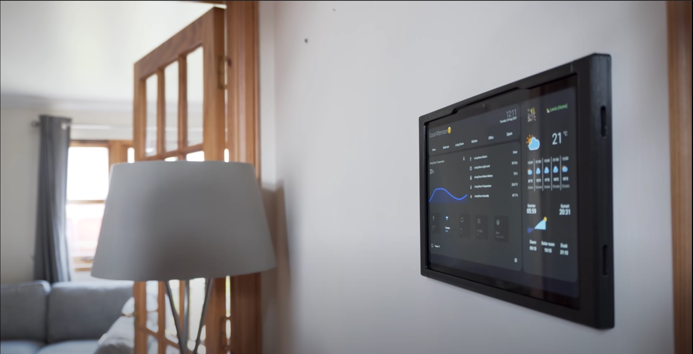

# Home Assistant Info

## Introduction

Home Assistant is free and open-source software under a [Apache 2.0 license](https://www.apache.org/licenses/LICENSE-2.0.html). This includes free commercial use with limitation to trademark. There is no warranty or official technical support provided with the software.

The first public release was made in September 2013 by the founder Paulus Schoutsen. What began as a Python project to control Hue light bulbs, grew to into arguably the most advanced home automation platform coming up on **150,000** active installations!

*Source: [Home Assistant Analytics](https://analytics.home-assistant.io/)*

There are currently **1.5k** [integrations](#Integrations) developed for Home Assistant.

To make sense of the rapid growth of Home Assistant, it's passionate DIY and software development community, you must first understand the values which direct the project.
Check out Paulus's blog post [Perfect Home Automation](https://www.home-assistant.io/blog/2016/01/19/perfect-home-automation/) where he explains his philosophy on for the smart home.

## Free & Open-Source Software

The virtually the entire internet runs on open-source software.
- web servers use Linux (98%~)
- web browsers
- front-end (javascript, css, web frameworks)

Prior to Linux, web servers ran proprietary operating systems which required expensive licensing fees and was often cost prohibitive.

Much of the success of open-source software has been driven by a global community of contributors. In many cases individuals donate their time to work on these projects, but there are often companies who support software in which they rely on.

There's a great security upside to open-source in that anyone can audit the code. In closed source or proprietary software you are delegating all trust to that organization to not provide you with code that disrespects your privacy or security. 

## Local Control

  Many smart home devices on the market rely on cloud services to operate. The cloud is really just a collection of computers operated by a 3rd party. A common example of this are automations which use Alexa. When you automate through the Alexa app you are essentially giving Amazon custody of your devices.

  When you use cloud services, you trust the organization with your data and control of the devices in your home. This is home automation prohibitive for many people who have a conception of the smart home that is 'Alexa is always listening'.

  Another downside when you use cloud services in a smart home is that when you loose connection to that server due to any kind of outage, all the processes you depend on cease to function.

  The Home Assistant server itself can run within a LAN (home network) on [hardware](#hardware) completely disconnected from the internet. 

  Home Assistant is cloud agnostic you can still integrate common cloud services such as Amazon or Google. You can use Alexa or Google Home with HomeAssistant as a 'middleman' between your devices. With [Nabu Casa Cloud](#nabu-casa-inc) you can access your Home Assistant instance from anywhere with an internet connection. The value is that users have the right to choose to use cloud services based on their level of trust.

  

## User Interface

  Lovelace Dashboard is Home Assistant's official user interface. It is highly customizable with a large selection of themes and 'cards' for displaying data an interacting with [integrations](#integrations). Lovelace is designed for both simple and advanced users, allowing users to build scripts and automations in a low-code/no-code environment.

  The dashboard is accessible by:
  - Web Browser
  - Mobile App (iOS/Android)
  - Desktop App (MacOS)

  *[LOVELACE DEMO](https://demo.home-assistant.io)*

  There are also alternative dashboards made available through the community for different use cases.
  

*Image Source: [Everything Smart Home](https://youtu.be/_FktMQSD5LE)*

## Integrations

Integrations are how Home Assistant interfaces with devices and services. With over **1.5k** officially supported integrations there's a lot to choose from.

Devices:
- thermostat, climate sensors
- smart lights (hue)
- security cameras
- door sensors
- electrical usage / solar
- presence sensors
- media (eg. audio, tv, gaming console)
- smart car

Services:
- weather
- voice assistant
- spotify

[full list of supported integrations](https://www.home-assistant.io/integrations/)

## State & Automations

Home Assistant includes a state machine and automation engine.

The state machine keeps track of the data from [integrations](#integrations).
- Paulus is away
- Temperature is 50°F

The automation engine let's you change state based on current state.
1. When Paulus is home
2. Set thermostat to 70°F

## Nabu Casa

Like many open-source projects, Home Assistant has a company backing [Nabu Casa](https://www.nabucasa.com/) Inc. Founded by Paulus Schoutsen in 2018, it currently provides affordable ($65/yr.), secure and convenient cloud access to Home Assistant instances as well as access to Google and Amazon cloud services. With this funding Nabu Casa invests back into Home Assistant with it's team of paid developers.

## Natively Supported Hardware 

  ### Raspberry Pi 4 B / Raspberry Pi 4 Computes Module

  **Price:** *$75*~

  Sufficient for most use cases. Extra components recommended for stable use.

  

  ### Home Assistant Yellow

  [Nabu Casa](#nabu-casa)'s flagship embeded device for running Home Assistant. Featuring a Raspberry Pi 4 compute module and a host of  peripherals.

  Released in October 2021 in a [crowdfunding campaign](https://www.crowdsupply.com/nabu-casa/home-assistant-yellow#products) to a success of over 300% funding.

  **Price:** *$115-$175*

  

  ### Intel Nuc 10

  **Price:** *$300-1000*~

  A micro PC produced by Intel. May be useful for supporting certain applications. Overkill in most situations but obselescence resistant.

  

  ### *[more information on installation methods ](https://www.home-assistant.io/installation/)*